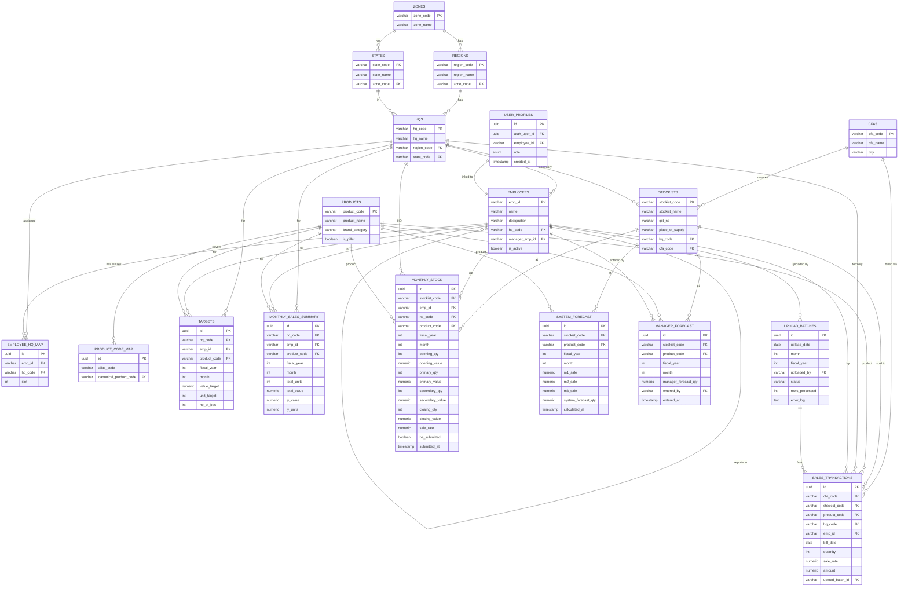

# Adonis Pharma Platform — Entity Relationship Diagram

```mermaid
erDiagram

  %% ─── AUTH ───────────────────────────────────────────────
  USER_PROFILES {
    uuid      id PK
    uuid      auth_user_id FK
    varchar   employee_id FK
    enum      role
    timestamp created_at
  }

  %% ─── GEOGRAPHY ──────────────────────────────────────────
  ZONES {
    varchar  zone_code PK
    varchar  zone_name
  }

  REGIONS {
    varchar  region_code PK
    varchar  region_name
    varchar  zone_code FK
  }

  STATES {
    varchar  state_code PK
    varchar  state_name
    varchar  zone_code FK
  }

  HQS {
    varchar  hq_code PK
    varchar  hq_name
    varchar  region_code FK
    varchar  state_code FK
  }

  %% ─── PEOPLE ─────────────────────────────────────────────
  EMPLOYEES {
    varchar   emp_id PK
    varchar   name
    varchar   designation
    varchar   hq_code FK
    varchar   manager_emp_id FK
    boolean   is_active
  }

  EMPLOYEE_HQ_MAP {
    uuid    id PK
    varchar emp_id FK
    varchar hq_code FK
    int     slot
  }

  %% ─── DISTRIBUTION ───────────────────────────────────────
  CFAS {
    varchar  cfa_code PK
    varchar  cfa_name
    varchar  city
  }

  STOCKISTS {
    varchar  stockist_code PK
    varchar  stockist_name
    varchar  gst_no
    varchar  place_of_supply
    varchar  hq_code FK
    varchar  cfa_code FK
  }

  %% ─── PRODUCTS ───────────────────────────────────────────
  PRODUCTS {
    varchar  product_code PK
    varchar  product_name
    varchar  brand_category
    boolean  is_pillar
  }

  PRODUCT_CODE_MAP {
    uuid    id PK
    varchar alias_code
    varchar canonical_product_code FK
  }

  %% ─── TARGETS ────────────────────────────────────────────
  TARGETS {
    uuid     id PK
    varchar  hq_code FK
    varchar  emp_id FK
    varchar  product_code FK
    int      fiscal_year
    int      month
    numeric  value_target
    int      unit_target
    int      no_of_bes
  }

  %% ─── SALES ──────────────────────────────────────────────
  SALES_TRANSACTIONS {
    uuid      id PK
    varchar   cfa_code FK
    varchar   stockist_code FK
    varchar   product_code FK
    varchar   hq_code FK
    varchar   emp_id FK
    date      bill_date
    int       quantity
    numeric   sale_rate
    numeric   amount
    varchar   upload_batch_id FK
  }

  MONTHLY_SALES_SUMMARY {
    uuid     id PK
    varchar  hq_code FK
    varchar  emp_id FK
    varchar  product_code FK
    int      fiscal_year
    int      month
    int      total_units
    numeric  total_value
    numeric  ly_value
    numeric  ly_units
  }

  UPLOAD_BATCHES {
    uuid      id PK
    date      upload_date
    int       month
    int       fiscal_year
    varchar   uploaded_by FK
    varchar   status
    int       rows_processed
    text      error_log
  }

  %% ─── STOCK MODULE ────────────────────────────────────────
  MONTHLY_STOCK {
    uuid     id PK
    varchar  stockist_code FK
    varchar  emp_id FK
    varchar  hq_code FK
    varchar  product_code FK
    int      fiscal_year
    int      month
    int      opening_qty
    numeric  opening_value
    int      primary_qty
    numeric  primary_value
    int      secondary_qty
    numeric  secondary_value
    int      closing_qty
    numeric  closing_value
    numeric  sale_rate
    boolean  be_submitted
    timestamp submitted_at
  }

  %% ─── FORECASTING ─────────────────────────────────────────
  SYSTEM_FORECAST {
    uuid     id PK
    varchar  stockist_code FK
    varchar  product_code FK
    int      fiscal_year
    int      month
    numeric  m1_sale
    numeric  m2_sale
    numeric  m3_sale
    numeric  system_forecast_qty
    timestamp calculated_at
  }

  MANAGER_FORECAST {
    uuid      id PK
    varchar   stockist_code FK
    varchar   product_code FK
    int       fiscal_year
    int       month
    numeric   manager_forecast_qty
    varchar   entered_by FK
    timestamp entered_at
  }

  %% ─── RELATIONSHIPS ───────────────────────────────────────
  ZONES         ||--o{ REGIONS         : "has"
  ZONES         ||--o{ STATES          : "has"
  REGIONS       ||--o{ HQS             : "has"
  STATES        ||--o{ HQS             : "in"
  HQS           ||--o{ EMPLOYEES       : "primary HQ"
  HQS           ||--o{ EMPLOYEE_HQ_MAP : "assigned"
  EMPLOYEES     ||--o{ EMPLOYEE_HQ_MAP : "covers"
  EMPLOYEES     ||--o{ EMPLOYEES       : "reports to"
  CFAS          ||--o{ STOCKISTS       : "services"
  HQS           ||--o{ STOCKISTS       : "in territory"
  PRODUCTS      ||--o{ PRODUCT_CODE_MAP : "has aliases"
  HQS           ||--o{ TARGETS         : "for"
  EMPLOYEES     ||--o{ TARGETS         : "for"
  PRODUCTS      ||--o{ TARGETS         : "for"
  CFAS          ||--o{ SALES_TRANSACTIONS : "billed via"
  STOCKISTS     ||--o{ SALES_TRANSACTIONS : "sold to"
  PRODUCTS      ||--o{ SALES_TRANSACTIONS : "product"
  HQS           ||--o{ SALES_TRANSACTIONS : "territory"
  EMPLOYEES     ||--o{ SALES_TRANSACTIONS : "by"
  UPLOAD_BATCHES ||--o{ SALES_TRANSACTIONS : "from"
  HQS           ||--o{ MONTHLY_SALES_SUMMARY : "for"
  EMPLOYEES     ||--o{ MONTHLY_SALES_SUMMARY : "for"
  PRODUCTS      ||--o{ MONTHLY_SALES_SUMMARY : "for"
  STOCKISTS     ||--o{ MONTHLY_STOCK   : "at"
  EMPLOYEES     ||--o{ MONTHLY_STOCK   : "BE"
  HQS           ||--o{ MONTHLY_STOCK   : "HQ"
  PRODUCTS      ||--o{ MONTHLY_STOCK   : "product"
  STOCKISTS     ||--o{ SYSTEM_FORECAST : "at"
  PRODUCTS      ||--o{ SYSTEM_FORECAST : "product"
  STOCKISTS     ||--o{ MANAGER_FORECAST : "at"
  PRODUCTS      ||--o{ MANAGER_FORECAST : "product"
  EMPLOYEES     ||--o{ MANAGER_FORECAST : "entered by"
  USER_PROFILES ||--|| EMPLOYEES        : "linked to"
  EMPLOYEES     ||--o{ UPLOAD_BATCHES   : "uploaded by"
```
